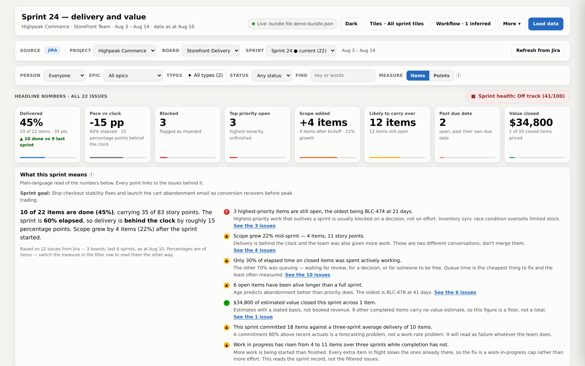
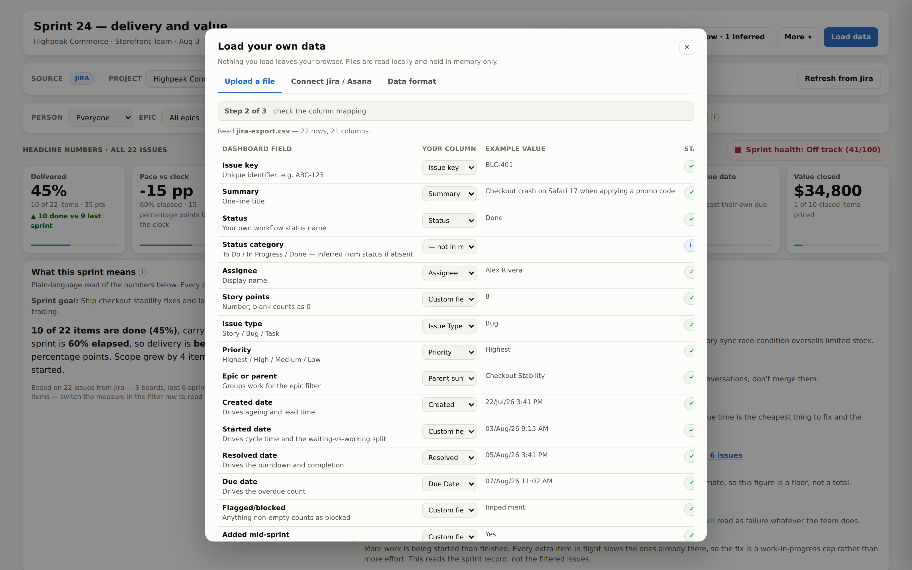

# Delivery Value Dashboard

A single self-contained HTML file that turns Jira or Asana data into a report an executive can read and an engineer can interrogate. Every number on the page clicks through to the issues behind it.

No install, no build step, no server, no internet connection, no runtime dependencies. Open the file.

```bash
git clone <your-fork-url> && cd delivery-value-dashboard
make build && open dist/delivery-value-dashboard.html
```

**[▶ Watch the 3-minute demo](docs/demo.mp4)** ([lighter 3.7 MB version](docs/demo-small.mp4)) · **[Executive summary of the agent](docs/agent-executive-summary.md)**

---

## What it does differently

Most sprint dashboards report activity. This one is built around the four questions activity reporting fails to answer:

- **Are we behind, or were we given more?** The burndown plots scope as a separate line, so mid-sprint additions are visible instead of being absorbed into a flat delivery line. It reads in **items by default**, with a Points toggle — items is the unit the forecaster uses, and it cannot be inflated by estimating generously.
- **Where does the time actually go?** Each closed item is one bar split into *waiting in a queue* and *actively worked*. On typical data most of the elapsed time is queueing — the cheapest thing to fix and the thing standard lead/cycle charts hide.
- **Is the commitment realistic?** Committed against completed for six sprints, with the trailing three-sprint average offered as the next commitment.
- **What is any of it worth?** Value figures carry a stated basis, and the card says how many completed items carry no estimate — so the number reads as a floor, not a total.

Every tile, bar and risk opens a panel listing the underlying issues with owner, points, age and an elapsed-time breakdown, and exports to CSV. The health score shows its full working on hover. The risk register is computed from the data on screen, including the current filter — not typed by hand.

[docs/dashboard-review.md](docs/dashboard-review.md) is the full argument, written against the dashboard this replaced.



## Getting data in

Three routes, in the order you should adopt them.

### 0. Pick a project, board or sprint — once the data is there

The dashboard holds many sprints at once. A context bar above the filters gives cascading **Project → Board → Sprint** pickers, plus an **All N sprints** rollup per board. Switching is instant and offline.

The page never talks to Jira itself — it cannot; MCP has no browser client and both APIs block cross-origin requests. Instead the sprints are bundled into the file up front, by the fetcher or by Claude through the Atlassian/Asana connectors. If you additionally run `make serve-live`, the page finds the local server and can pull sprints the bundle does not contain, on demand.

Full detail: [docs/contexts-and-live-mode.md](docs/contexts-and-live-mode.md).

### 1. Upload a file — works immediately

**Load data** → drop a `.csv`, `.tsv`, `.xlsx` or `.json` file. A raw export straight out of Jira or Asana is fine; column names are matched automatically and every guess is shown for you to correct before anything is applied.

The wizard is three steps: choose → map → preview. The preview shows counts, the first rows as the dashboard will read them, and warnings for duplicate keys, ambiguous date formats, and each missing field with its consequence stated. Burndown and sprint history are **recalculated** from what you upload rather than inherited, so you never get fresh numbers under a stale chart.



Full detail: [docs/importing-data.md](docs/importing-data.md).

### 2. Fetcher script — for regular refreshes

```bash
pip install -r scripts/requirements.txt
cp .env.example .env          # add your API token; .env is git-ignored

./scripts/refresh.sh          # one sprint  -> data/dashboard-data.json

# or a bundle: several boards, six sprints each, one file
python3 scripts/fetch_delivery_data.py --jira-boards 42,43,51 --sprints 6 \
  --out data/dashboard-data.json
```

Then drop that file onto the upload panel, or `make serve` and open `?data=data/dashboard-data.json`. Schedule it with cron for a hands-off morning refresh.

The script derives two things a CSV export cannot give you: **cycle time**, from the first transition into an in-progress status in the Jira changelog, and **mid-sprint additions**, from when the sprint field was set.

For a Jira that is not your own, connect it with OAuth instead of a personal API token — a grant the customer consented to, scoped read-only, and revocable by them:

```bash
python3 scripts/jira_auth.py login          # one-time, after registering the app
python3 scripts/fetch_delivery_data.py --jira-board 42
```

Both paths stay supported and the fetcher prints which one it used. Setup, scopes and where the grant is stored: [docs/connecting-jira-asana.md](docs/connecting-jira-asana.md).

### Telling it what "done" means

Which statuses count as finished, which days are worked, the holiday calendar and the sprint length live in `config/organisation.json` — they used to be assumptions written into the code. The resolved config is written **into** the dataset, so the page, the agent's tools and the live server all read the same one and cannot describe a sprint under two different calendars.

```bash
python3 agent/tools/orgconfig.py config/organisation.json     # validate it
```

Statuses the config has never seen are named at the end of every run rather than quietly read as *To Do*. Adopting the file changes no number: its defaults are what was hard-coded before. Full reference: [docs/organisation-config.md](docs/organisation-config.md).

### 3. MCP connectors — once the format has proved itself

Connect the Atlassian and Asana connectors in Claude and ask in plain language: *"pull Sprint 25 and rebuild the dashboard data."* Same JSON contract, nothing to run. Keep the fetcher for scheduled refreshes.

Full detail: [docs/connecting-jira-asana.md](docs/connecting-jira-asana.md).

## Monte Carlo forecasting, in the page

With `make serve-live` running, a **Monte Carlo forecast** tile answers two questions for whichever team, board and sprint is selected, and re-runs when you change that selection:

- **When will it finish** — percentile completion dates for the work outstanding in the selected sprint.
- **How many by the date** — how much lands by the sprint end, plus what to commit to next sprint.

The simulation is run by `agent/tools/forecast.py` over the connection, not reimplemented in the page. That is the point: a second Monte Carlo would be a second set of numbers, and the tile and a written brief would eventually disagree about the same sprint.

It samples **the whole recorded history of that team**, not just the sprint on screen — one sprint offers too few observations and the tool refuses. Only the outstanding count comes from the selected sprint. The tile names the slice, the date span and the observation count so the basis is auditable, and prints refusals verbatim when the evidence is thin.

Each question takes an input, so the tile answers hypotheticals as well as the sprint in front of you:

- **When** — set **how many items**. Defaults to the sprint's outstanding count; type `30` and you get the delivery range for a 30-item ask against that team's measured pace. The figure is labelled as asked-for so it can never be read as the sprint's own.
- **How many** — set **a date**. Defaults to the sprint end; pick any date and you get how much lands by then.

A third mode, **Sequence asks**, runs `intake.py --sequence` for the selected board: what each ordering of that board's outstanding asks costs the others. It leads with the asks that miss their date in *every* ordering — that is not a prioritisation problem, and saying so stops a meeting re-arranging a list that cannot be re-arranged into success — then the comparison, then any ask it could not size, named with the tool's reason. No value score is computed, here or anywhere else. Asks are read from `data/asks/` per board.

Rejected input says so rather than quietly reverting, and a request too large for the simulation's 400-working-day horizon states that the dates are a floor rather than an estimate — without that, every percentile reads exactly the horizon and looks like an answer.

Because it needs the local server, this tile shows an offline notice rather than a forecast in an emailed copy. If you are sending a view on, untick it under **Tiles**.

## Repository layout

```
├── CLAUDE.md             the constraints, for any agent working in here
├── src/
│   ├── index.html        page structure + build placeholders
│   ├── styles.css        all styling, both colour themes
│   ├── app.js            metrics, charts, filters, drill-downs
│   └── import.js         file parsing + the upload wizard
├── dist/
│   └── delivery-value-dashboard.html    ← built output, committed
├── config/
│   └── organisation.json                what "done" means, which days are worked
├── data/
│   ├── sample-sprint.json               demo dataset and worked example
│   ├── asks/                            worked product-intake requests
│   └── templates/                       CSV + JSON starting points
├── scripts/
│   ├── fetch_delivery_data.py           Jira + Asana → JSON
│   ├── jira_auth.py                     OAuth 2.0 (3LO) login, refresh, sites
│   ├── rebuild_burndown.py              recompute a burndown in both units
│   ├── make_sample_bundle.py            random bundle, for load testing
│   ├── make_demo_bundle.py              authored bundle, for the demo
│   ├── record_demo.py                   records both demo videos
│   ├── serve_live.py                    optional live-mode server
│   ├── refresh.sh                       cron-friendly wrapper
│   └── requirements.txt
├── service/                             the routes the Forge function runs under WebAssembly
│   ├── routes.py                        projection, caps, refusals, answer(); computes nothing
│   └── README.md                        what it is, and what used to be beside it
├── forge/                               the Forge app — deployed, no remote, no egress
│   ├── manifest.yml                     scopes, the consumer, the functions
│   ├── src/index.js                     projects, hands to the Python in-function, re-attaches
│   ├── src/runtime.js                   loads Pyodide from the generated bundle
│   └── README.md                        how it is built and deployed
├── docs/
│   ├── dashboard-review.md              why it is built this way
│   ├── importing-data.md                the upload pipeline
│   ├── data-format.md                   every field and what it drives
│   ├── connecting-jira-asana.md         live data, OAuth, and why not from the page
│   ├── organisation-config.md           what "done" means, and which days count
│   ├── forge-deployment.md              runbooks for the three unfinished pieces
│   ├── adr/                             eight decision records, indexed in adr/README.md
│   ├── contexts-and-live-mode.md        project/board/sprint filtering
│   ├── product-intake.md                forecasting an ask before it exists
│   ├── agent-executive-summary.md       the agent, for a leadership audience
│   ├── demo.mp4                         captioned walkthrough, 2m50s (11 MB)
│   ├── demo-small.mp4                   same, 1200px / 3.7 MB, for email
│   └── forecasting-agent.md             the agent's design outline
├── agent/                               reporting & forecasting agent
│   ├── SKILL.md                         the agent definition — runnable
│   ├── tools/metrics.py                 deterministic facts pack
│   ├── tools/forecast.py                Monte Carlo forecasting
│   ├── tools/intake.py                  product-intake sizing and forecasting
│   ├── tools/orgconfig.py               the per-organisation assumptions
│   ├── templates/                       exec brief + team report + intake brief
│   └── snapshots/                       facts packs, scope history, forecast log
├── tests/
│   ├── e2e.py                           browser suite, 101 checks
│   ├── test_agent.py                    facts, forecast, intake, org config
│   ├── test_service.py                  the routes and the resolver: projection, refusals, jobs
│   ├── test_wasm.py                     the same Python under WebAssembly, byte for byte
│   ├── perf.py                          timing harness, four bundle sizes
│   ├── a11y.py                          WCAG 2.2 AA, both themes
│   ├── security.py                      hostile-data, secrets and server checks
│   └── fixtures/                        realistic Jira/Asana/XLSX exports
├── build.py                             the whole build, ~80 lines
└── Makefile
```

`dist/` is committed on purpose: the repository can be downloaded and used without running anything. CI fails if it is stale, so run `make build` and commit the result alongside any `src/` change.

## Commands

| Command | Does |
|---|---|
| `make build` | Assemble `src/` into `dist/delivery-value-dashboard.html` |
| `make test` | Build, then run the browser end-to-end suite |
| `make serve` | Preview on `localhost:8000` |
| `make check` | Fail if `dist/` is stale (what CI runs) |
| `make fetch` | Pull live data using `.env` |
| `make test-agent` | Agent tools only — facts, forecast, refusals, backtest |
| `make report` | Print the facts pack and forecast for the sample data |
| `make serve-live` | Serve with the live-mode API, backed by the demo bundle |
| `make bundle` | Regenerate the demo bundles, including the intake reference class |
| `make intake` | Forecast a product ask — `ASK=data/asks/INTAKE-2026-014.json` |
| `make intake-scale` | Print what S/M/L/XL mean on a board, in items |
| `make intake-sequence` | What each ordering of the outstanding asks costs the others |
| `make perf` | Measure load and interaction cost at four bundle sizes |
| `make demo` | Rebuild the story bundle and re-record the demo video |
| `make test-a11y` | Accessibility only — WCAG 2.2 AA, both themes |
| `make test-security` | Security only — XSS, pollution, traversal, secrets, deps |

## The reporting & forecasting agent

`agent/` holds an agent that turns the same dataset into an executive brief and a team report, and forecasts when outstanding work will actually finish.

Its one architectural rule: **the agent never does arithmetic.** Every figure comes from `agent/tools/metrics.py` (facts) or `agent/tools/forecast.py` (Monte Carlo over item throughput, seeded, 20,000 trials). The agent narrates, diffs against the previous snapshot, and frames the decision. That boundary is what makes a report from a language model auditable.

```bash
make report        # facts pack + forecast for the sample data
make test-agent    # including a walk-forward backtest of the forecaster
```

It refuses rather than guesses: on a single sprint of data the forecaster returns *"too little completion history to sample from — a wider confidence interval would not fix this, the data is absent, not noisy."* On twelve weeks it returns a 4% probability of the sprint landing complete, and an 85th-percentile finish eight working days late.

### Forecasting an ask before any of it exists

The same engine answers the question that arrives *before* the tickets do: a described product ask plus a named team, in, and a sized range with two delivery scenarios out.

```bash
make intake-scale                                    # what S/M/L/XL mean on this team, in items
make intake ASK=data/asks/INTAKE-2026-014.json       # one ask, both scenarios
make intake-sequence                                 # what each ordering costs the others
```

T-shirt bands are calibrated from the board's own completed epics rather than assumed, because an "L" has never meant the same thing on two teams. Every forecast returns **earliest possible** and **realistic** — the difference between them is the cost of the existing queue, in working days, which is the number to quote when someone asks why it cannot start now. And it attributes the uncertainty: *61% of this range is not knowing how big the ask is* sends it back to refinement, while *83% is normal delivery variability* says the estimate was never the problem.

No priority score is computed — not WSJF, not anything of that family. The delivery consequence of each ordering is computable and is returned; the relative worth of competing asks is a judgement and stays with the people who own it.

Design outline, question inventory, guardrails, failure modes and rollout: [docs/forecasting-agent.md](docs/forecasting-agent.md). Intake method and thresholds: [docs/product-intake.md](docs/product-intake.md).

## Deploying

- **Email it.** One file. This is the intended distribution method.
- **Shared drive.** Drop `dist/delivery-value-dashboard.html` next to `dashboard-data.json`.
- **GitHub Pages.** `.github/workflows/pages.yml` publishes the built file and the whole of `data/`. It never runs on its own — it is `workflow_dispatch` only, so you start it from the Actions tab and it publishes at no other time. Do not run it on a repository where the fetcher has written real issue titles unless your plan supports private Pages. CI itself needs nothing configured: no secrets, no environment.
- **Board pack.** The **Print** button lays the page out cleanly to PDF.

### Sending one audience their own view

The **Tiles** button chooses which of the thirteen tiles a view contains, and what order they appear in. Two presets are built in, and both keep *What this sprint means* — a view without the narrative is the wall of charts this page exists to replace.

| Preset | Tiles | Shaped after |
|---|---|---|
| **Executive** | narrative, headline numbers, forecast trust, release quality, value, releases, risks | `agent/templates/exec-brief.md` |
| **Team** | narrative, headline numbers, burndown, per-person work, flow time, ageing, forecast trust, team load, risks | `agent/templates/team-report.md` |

The presets deliberately match the two reports the agent already writes. A printed view and the agent's brief for the same audience disagreeing about what matters is worse than either being slightly wrong alone.

Three ways to send one:

- **Save this view as a file** — writes a standalone HTML copy with the view *and the data currently loaded* baked in. This is the one to email.
- **Print** — hidden tiles do not print, so the PDF matches what is on screen.
- **A link** — the view travels as `?view=exec`, `?view=team` or `?tiles=c-exec,c-risk`, which is useful when the file is hosted rather than emailed. A custom order rides along as `?order=c-risk,c-exec,...`.

Hiding a tile changes what is shown and never what is counted: every figure still comes from the same computation over the same filtered issues. The picker names the tiles it has hidden rather than only counting them, because a view that quietly drops a tile reads as a whole page to whoever receives it. The same goes for a custom order, which the picker says it is using.

### Putting the tiles in your own order

Each row in the **Tiles** popover carries a **Move** button that opens a menu of four moves: to top, up, down, to bottom. A move relocates the tile itself rather than setting a CSS `order`, so the tab order and the screen-reader reading order follow the picture — and the menu is ordinary buttons, so the whole feature works from the keyboard (Enter opens it on the first move the tile can make, arrows walk it, Escape closes it). Drag and drop would not have; the menu is the pattern Atlassian's own reorderable lists use inside Jira.

Order and selection are separate: `?tiles=` says which tiles, `?order=` says in what sequence, and un-ticking a tile never reshuffles the page. **Default order** puts everything back.

One thing to know: tiles keep their widths when they move. The grid is twelve columns wide and the default order fills every row of it, but an order of your own can leave a row short. The picker says when the order is custom; the page will not stop you.

## Why HTML rather than PowerPoint or a BI tool

PowerPoint is a snapshot: no drill-down, no filtering, stale on export. Its one advantage — surviving a board pack — is covered by the print stylesheet.

A hosted BI tool (Power BI, Tableau, Looker) is the right destination once this is a standing report across many teams with row-level permissions. It costs licences, a pipeline and an owner. Don't start there; prove which metrics people actually use first. Migration is easy later because the data contract is already explicit.

Single-file HTML sits on the right rung: no infrastructure, no licences, works offline, and emails as an attachment.

## Security & accessibility

Both are tested, not asserted. `make test` runs all five suites; `make test-a11y` and `make test-security` run them individually. Every one of them runs on every push.

**Accessibility** — WCAG 2.2 AA against the rendered page in both themes, including states a static scan misses (the drill-down panel, the import wizard). Covers accessible names, heading order, form labels, table twins for every chart, colour-never-alone, computed text contrast, keyboard operation, focus order and return, focus visibility, reduced motion, and reflow at 380px.

**Security** — the threat model is that this file gets emailed, and that its data comes from a tracker where any user can write an issue summary. The suite feeds it a dataset with an injection attempt in every string field and asserts nothing executes; checks prototype pollution, `javascript:` URLs, zero network calls, zero persistence; probes the live server for path traversal and non-loopback reachability; feeds the XLSX reader a workbook carrying an XXE, an entity-expansion bomb and a zip-slip filename; and scans the tree for committed credentials.

**Credentials and egress** — the OAuth grant is git-ignored, created mode 0600 rather than widened afterwards, and never printed; the redirect listener verifies its `state` parameter and binds to loopback only; the requested scopes are asserted read-only, so adding a write scope fails the build. The hosted calculator is covered separately: it refuses free text rather than discarding it, and its field list is compared against the Forge resolver's so the side that decides what leaves a tenant and the side that decides what is accepted cannot drift apart.

Both suites found real bugs on their first run. See the changelog.

## Privacy

- No network calls from the built file. No CDN, no fonts, no analytics, no telemetry.
- No `localStorage`, no cookies, no persistence of any kind. Uploaded files are read in the browser and discarded when the tab closes.
- Credentials exist only in the fetcher's environment.
- `data/dashboard-data.json` is git-ignored by default because it contains real issue titles.

## Known limits

- The reconstructed burndown assumes an issue's points leave the chart on its resolution date. If your Jira has a sprint report you trust more, substitute it in `build_burndown()`.
- `history[]` keeps the last six sprints and grows one row per refresh; run the fetcher at least once per sprint or the trend charts thin out.
- Team load is measured as work in progress and unplanned work, both from issue status. There is no hours or overtime field anywhere in the schema, by design — see [docs/data-format.md](docs/data-format.md).
- Value figures are planning-time forecasts, never reconciled against actuals. That is a process gap, not a tooling one — close it at 90 days.
- `.xlsx` reading needs `DecompressionStream` (Chrome/Edge 103+, Safari 16.4+, Firefox 113+). Older browsers are told to use CSV.

## Licence

MIT — see [LICENSE](LICENSE).
